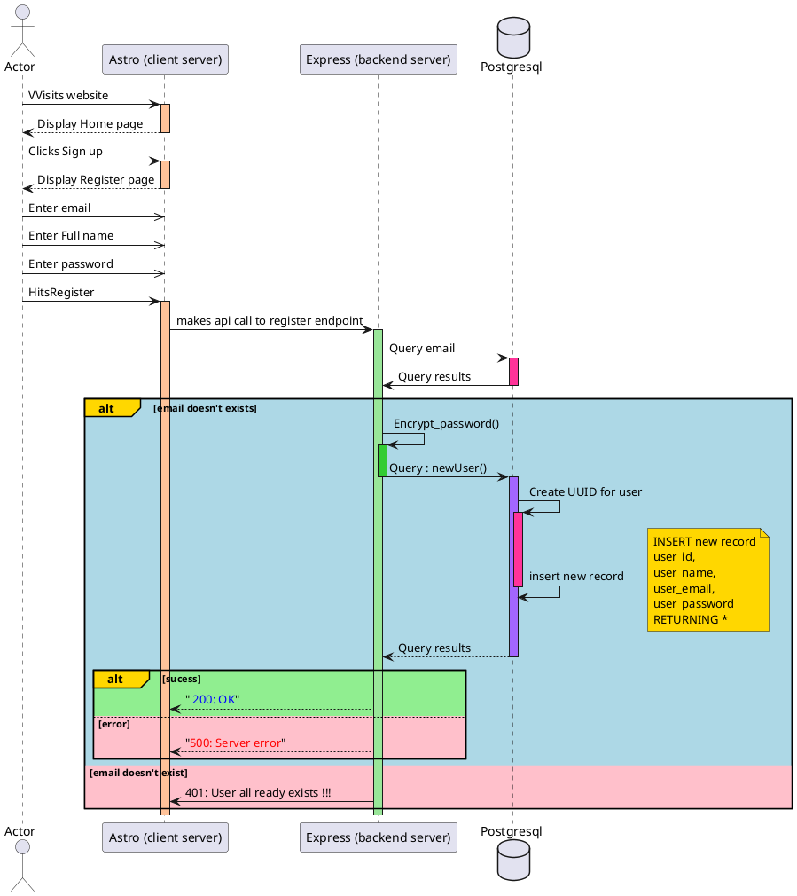

![Alt text](
https://www.gravizo.com/svg?@startuml;actor%20Actor%20as%20A;participant%20%22Astro%20%28client%20server%29%22%20as%20CS;participant%20%22Express%20%28backend%20server%29%22%20as%20BS;database%20Postgresql%20as%20DB;A%20-%3E%20CS%20:%20VVisits%20website;activate%20CS%20%23FFC299;CS%20--%3E%20A%20:%20Display%20Home%20page;deactivate%20CS;A%20-%3E%20CS%20:%20Clicks%20Sign%20up;activate%20CS%20%23FFC299;CS%20--%3E%20A%20:%20Display%20Register%20page;deactivate%20CS;A%20-%3E%3E%20CS%20:%20Enter%20email;A%20-%3E%3E%20CS%20:%20Enter%20Full%20name;A%20-%3E%3E%20CS%20:%20Enter%20password;A%20-%3E%20CS%20:%20HitsRegister;activate%20CS%20%23FFC299;CS%20-%3E%20BS%20:%20makes%20api%20call%20to%20register%20endpoint;activate%20BS%20%2399E699;BS%20-%3E%20DB%20:%20Query%20email;activate%20DB%20%23FF3399;DB%20-%3E%20BS%20:%20Query%20results;deactivate%20DB;alt%23Gold%20%23LightBlue%20email%20doesn%27t%20exists%20;%20%20BS%20-%3E%20BS%20:%20Encrypt_password%28%29;%20%20activate%20BS%20%2333CC33;%20%20;%20%20BS%20-%3E%20DB%20--%20:%20Query%20:%20newUser%28%29;%20%20activate%20DB%20%23A366FF;%20%20DB%20-%3E%20DB%20:%20Create%20UUID%20for%20user;%20%20activate%20DB%20%23FF3399;%20%20DB%20-%3E%20DB%20:%20insert%20new%20record;%20%20note%20right%20%23Gold;%20%20%20%20INSERT%20new%20record;%20%20%20%20user_id,;%20%20%20%20user_name,;%20%20%20%20user_email,;%20%20%20%20user_password;%20%20%20%20RETURNING*;%20%20end%20note;%20%20deactivate%20DB;%20%20DB%20--%3E%20BS%20:%20Query%20results;%20%20deactivate%20DB;%20%20deactivate%20DB;%20%20alt%23Gold%20%23LightGreen%20sucess;%20%20%20%20BS%20--%3E%20CS%20:%22%20%3Cfont%20color=blue%3E200:%20OK%3C/font%3E%22;%20%20else%20%23Pink%20error;%20%20%20%20BS%20--%3E%20CS%20:%20%22%3Cfont%20color=red%3E500:%20Server%20error%3C/font%3E%22;%20%20end;else%20%23Pink%20email%20doesn%27t%20exist;%20%20BS%20-%3E%20CS%20:%20401:%20User%20all%20ready%20exists%20!!!;end;@enduml;)