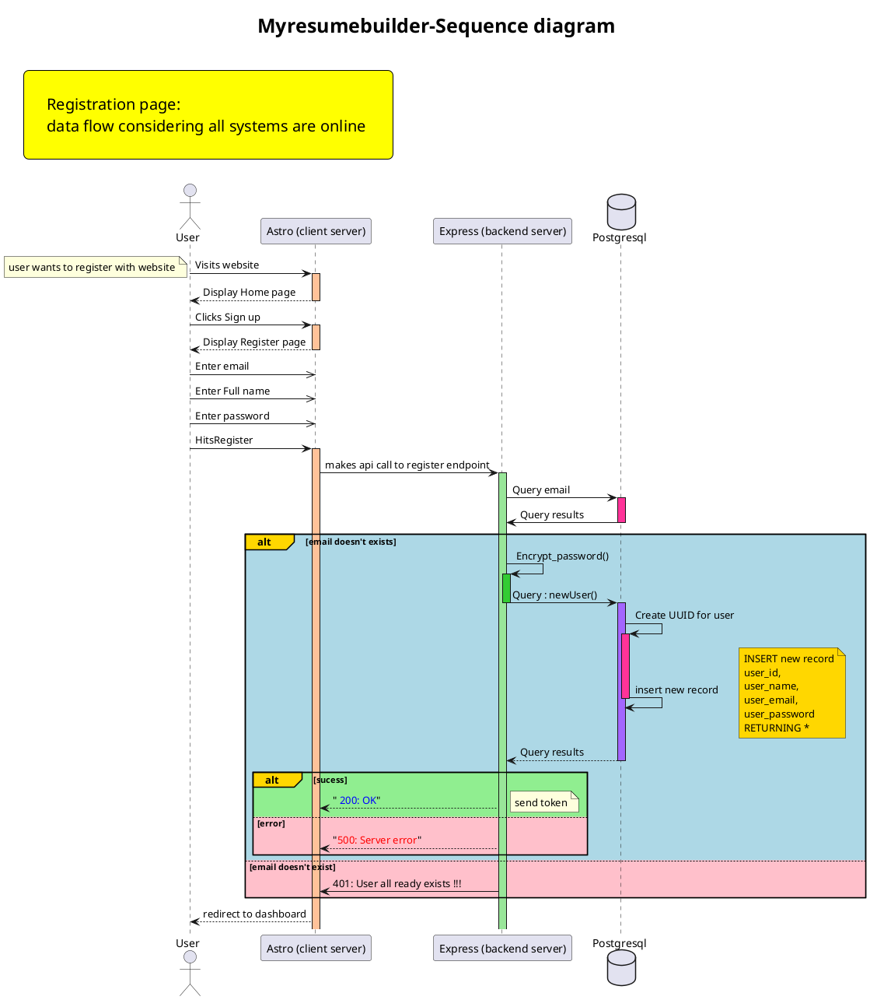

![rgistration page](https://www.planttext.com/api/plantuml/png/TLNRKjim47tNLop9Gw5JXXGNPl3G3Ba2qvRI1FhAAFPYD94bLv89ATD_xww3WyFbATxRsRCNRKvya2wKkHRYs8UbnguG6ZCqwQEOoMIUELkQDB7QkdY9Mjk5kBKcUFKNu_sEoANBb8cZZYXacYgJyUS_8O8A6XyRhWUaFTwhCrHc-B5qwCiSPwNIARhTAVufqIG8gPAPatdD188jGEDj400Jp9GFJWPb3HGomvYKgGmIReaR9DPuHLZ41AJMu9S-OEv1EWHhj388WX5Nm4B895W7rnuTI0yzgi85bQX2cW2j7YMoi9reXIIIppswdHOx3gQRdgE7WahniCqjO_ocStygcE1CUeHBwqD6hdyqMuPz8NgmsoKyYE6tyYfuME2CVf6fgNiPa8tjyNYmVtGaXB6aU6f5oQmNbDzJWy1LZM6D2dTh4ER2CO90TYbHZ_8CbI-qNCAPpR5geKYnaQn9QQ1LClSmLPc1idYRqXl8avhBU-XFy2F3JfXBfL-hnoNDpyWSNviAwVt2khJ1z8nQLwTzdsUNXa7EkPmZxKIX8E4bQNQF6bPOPS8p1aMqZuv6XupHhp26VSBuLQ9RFd5V-vA5yaKH-z9tdM_boykkWs_sWnT0wj0-jJg5zdULtOM-Bd452wb5Rpu4m0VYve56td-kOMGIjop2JTsBxHsoRv2Eei4WYaYx3cHAksi-CHXSyEflXd8DlUZmS3mcxQg8gk21GpPVNvyFuPOU3Q_VoxYwzer0PSWpS39gGS9ZWsedmN6zK1LFAe3pY-beShNfk5hp6vL-UXPuAHfYrQo6lDuEran6LzUJY_EBK_X8ylevqCtOcCAAyDlpUktxKdunmbE7QC2N2Ps4YaH_zKHuKLjmp4SHgelwTKR3xkvtEZ7y_7QynuPkgufuxayb0XsKwWxISQaKZK9GqrrfNoep1tJEkfSPeTNCw33j7d32QNMXLY6Dr7mLcuYl5t6zJHNubyxd-Eb-qakY5KcNzRvkRMtn_MaU2CgkQBI1drmg_TtCIfhJ2NdHFz1_)