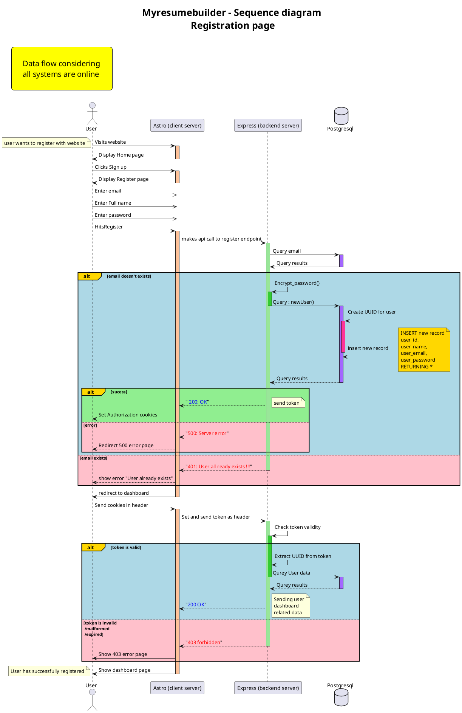

![registration page](https://www.planttext.com/api/plantuml/png/XLPjKnit4FwkNx6OpfGqPKBiXXayn1Di367QqjGE_TGPHdUts1hBqaNI0Kwc_xsxEf-jCv1yigLzU_RjqNtmGRfGBRKGUp_b_bRcGTtBWBTluJrqBYv6tPEJpeweooA-p7RrJqx6nxL-jglVwur6lHwBYcp7wgntV7nniIlgrW1wFNOeJdrOQHm8eN66flWcCfalPivMfiYjjgw_GgtjWxYp9dZr5VlT8x6KRgPCltSaIbaKoipuxtz211KqVajKtz7jwPicGXJ3dok7lbfYLYbTe8D3cEAN2asEK2WvStBvhu49pfGFJWPb3PHoXj00X61Bq7WN1C2v31Bk21tardX5tWWBtKkjmQzymAK7wH2iqSgG2pQllGX1vR0ERZmXa1xEA1CNLAvAQG8LZc9RECYrGZgIpZswLnrM74tRckF7ajBnSC1bO_-fyd0g2eAOIO_moVem8zKlcYNdGo7Eu710_g0F_oYlWeS7pEWNHTCf5kwtPqS8OqcmphzYz0-4mrDLmCMQyOqAyuqpniGsWfmTKi0pYdUkVAdb2ZxQ9SRgYWAJe2cqaLRvmiDKpGnKvVUXFHDXqc1wASewpDYm4Ywbqa-lBohgfv5BV2egfVSFrXK9uezKoYRiZ_4Eg4baj9GBf5af5UGyF6argO2bLIPiVGtPLzRsDOo-peVaw-yAtMgToyQ69Flj1HM2xfhujGqlXWu-hHCFYjHX_zBg0lR_KBDv6EeAQ_TGMFJcvm3uI5Wzq4WCjpcDJUvMPRXjQdJmYbVZnIIw9DquO6Y76rnzCFZ0gz9syKnE07LIiH0ZXwnsStDr3dUqR3oktxNlYhO3PSWYS70gJSvjXZZBuBWE48j2Lm1NrzFnv7DRiLwFMrNykZtm42N7MCJal9aclfcCFzzChg-kB-4NEc_M2A3TdHhmytryghjxtcdjfKCquAkSA2M26DOhnOFTWLCcLeYi_3wZ8HXqZuxwyDVlfszOCEX4YsrzuX68a29f4Zd5YoIHs6-0P6sd6E2i2dFhrDUQUtDh5mfzeusQg6p_ap8BGEUismK9dHIamsBmZZ5E8odM9YsqIUm95egQ5u0iQisQD29aaGQEer-FlFX1zD-EtlRN94zhJVDOh9fbsTlRIw0aZI7MRW7pStfWQa2TjQlK4Lb7actuX4rSamiHII7zFBEIfgf5Vn3vhmR--lKEDyLMaCzrzMaHO4uXQNqsdCKssHER03A-GKtB-QrPMmvVikpogiunNwnDxgLMXGghvucdrb6-LXCftppIWqqvr_lkx78zTGcZSEZsLmglZCDLtID-B45izsbDGInlLkh5RZSBaUw3Q2q3LvI-3neQslO5oBicE4K4i7qnqw7RfArCJ9o-KTuifIPQMs8yu6D9BIyIW17zCnFPOpBCL56WsI3TZiwKfusLaXM87ooDIdGRjJOPr5hfbq4ivvoQJrp2P797J-XgywOHp6sIGdoW0tse_Wy0)
