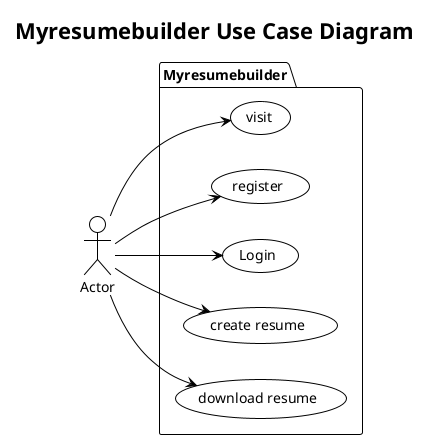

```plantuml
@startuml
!theme plain
title Myresumebuilder Use Case Diagram

left to right direction

actor Actor 
package Myresumebuilder{
usecase "visit" as uc1
usecase "register" as uc2
usecase "Login" as uc3
usecase "create resume" as uc4
usecase "download resume" as uc5

Actor --> uc1
Actor --> uc2
Actor --> uc3
Actor --> uc4
Actor --> uc5

@enduml
```
