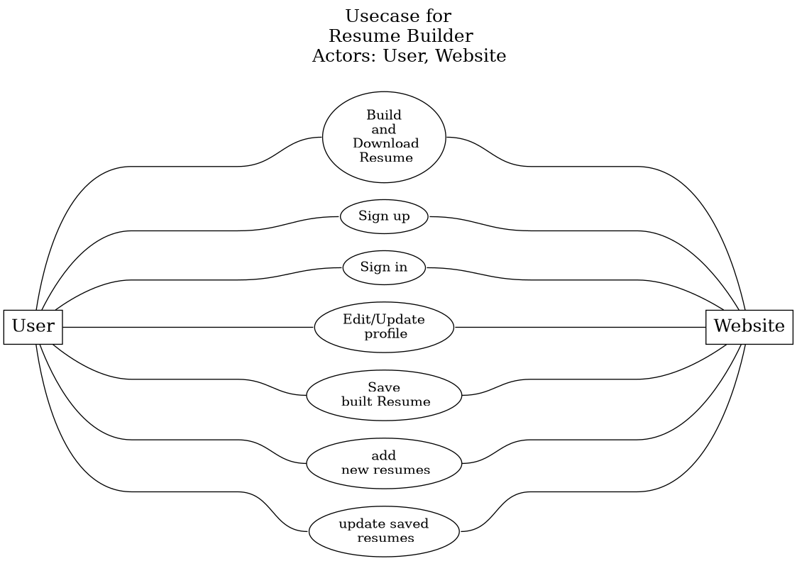

# Use Case: Resume Builder Website
> Actor: User, Website

1. User signs up on the Resume Builder Website by filling out a registration form.
2. User logs in to the Resume Builder Website and is directed to a dashboard.
3. User clicks on ‘Create Resume’ button to start building the resume.
4. User is prompted to enter personal information such as name, contact details, address and education background.
5. User enters details of any prior work experience.
6. User clicks on ‘Preview’ button to view the resume he has created.
7. User is able to modify information in the resume by editing respective fields.
8. User selects a resume template from the templates available on the website.
9. User clicks on ‘Save’ button to save the updated resume.
10. User is directed to a page where he can either download resume in different formats , as well as print the resume or share that resume with respective companies or social media.
